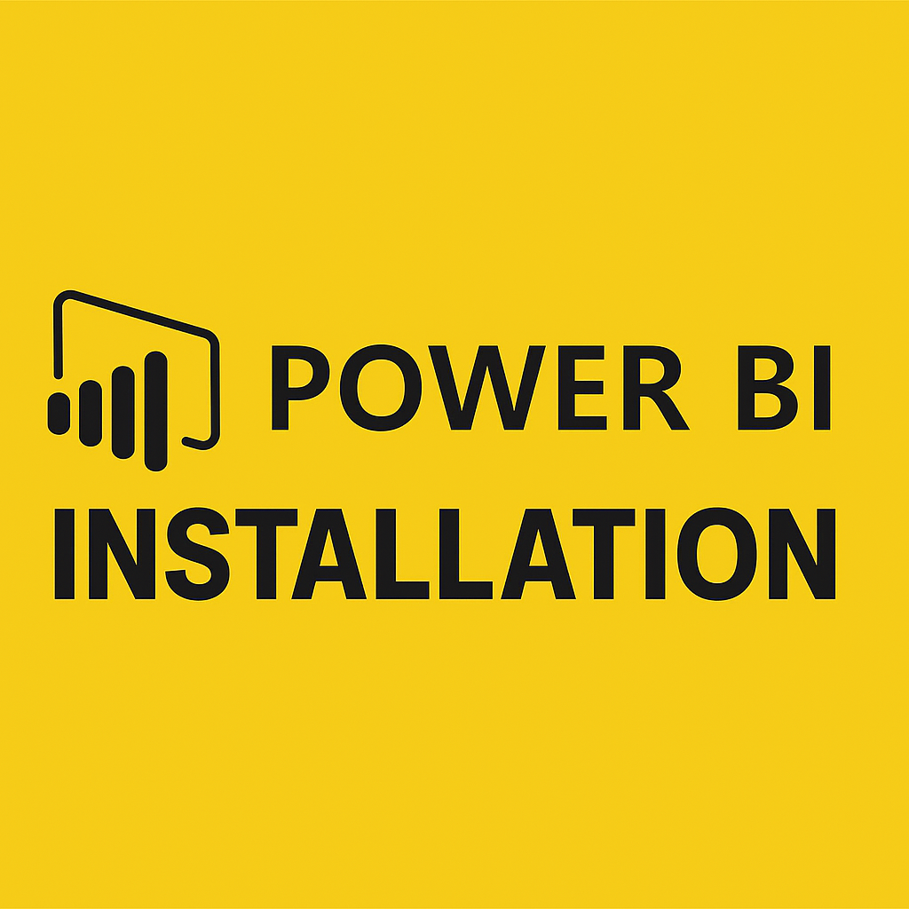
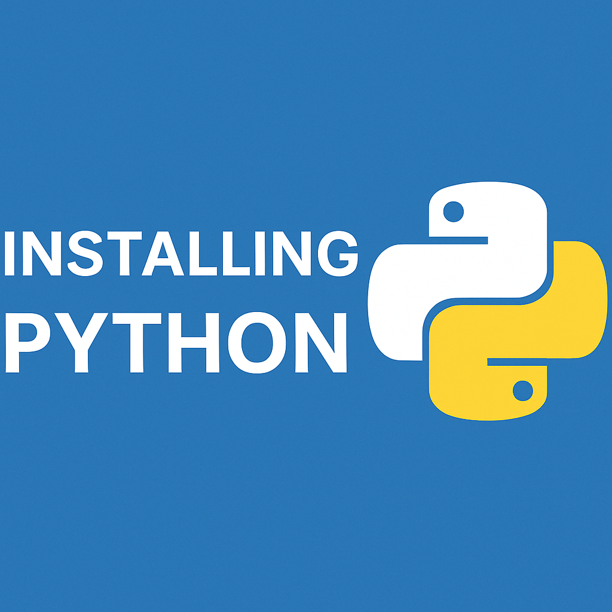

<h2>Videos for Software Installations</h2>

<h3><a href="https://youtu.be/K5TFEhUUVBc">Power BI</a></h3>

<h3> Python</h3>
Link to UV (used in Video for Installation)
 
 

<h4><a href="https://youtu.be/PlT4e6zcvxM">Installation for Windows</a></h4>

 

<h4><a href="https://youtu.be/VteoxFYoqY4">Installation for MacOS</a></h4>

</a>

<h2> Videos for Teaching Cases</h2>
<h3> Videos for Case 2: Procurement Reporting </h3>

<h4>
<a href="https://youtu.be/Mfpr1Y_cnto">
Data Load in Power BI</a>
</h4>

<h4>
<a href="https://youtu.be/1Z0GPqjHxzQ">
Data Model and Calculated Columns in Power BI
</a>
</h4>

<h2>Recommended Books</h2>

<h4>
<a href="https://www.statlearning.com/">Introduction to Statistical Learning</a>
</h4>
<h4>
<a href="https://christophm.github.io/interpretable-ml-book/">Explainable Machine Learning</a>
</h4>

