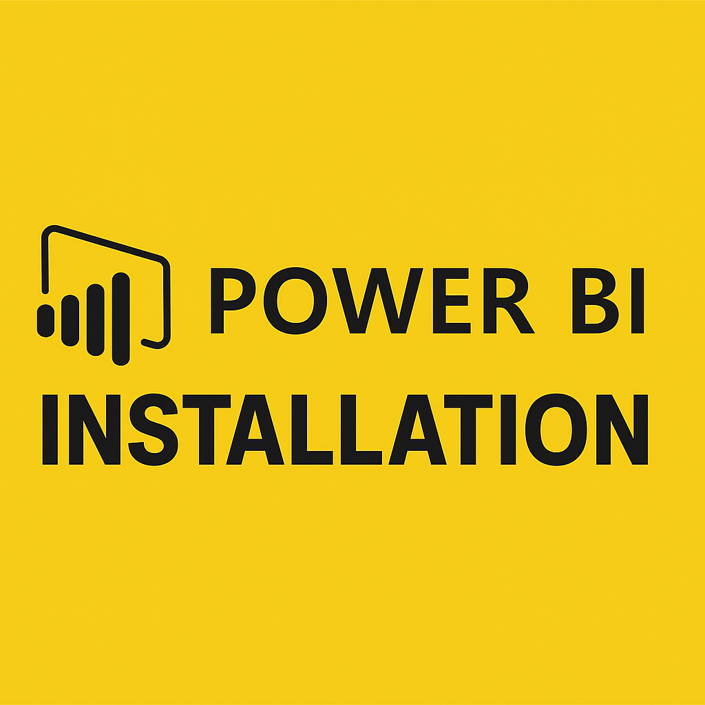
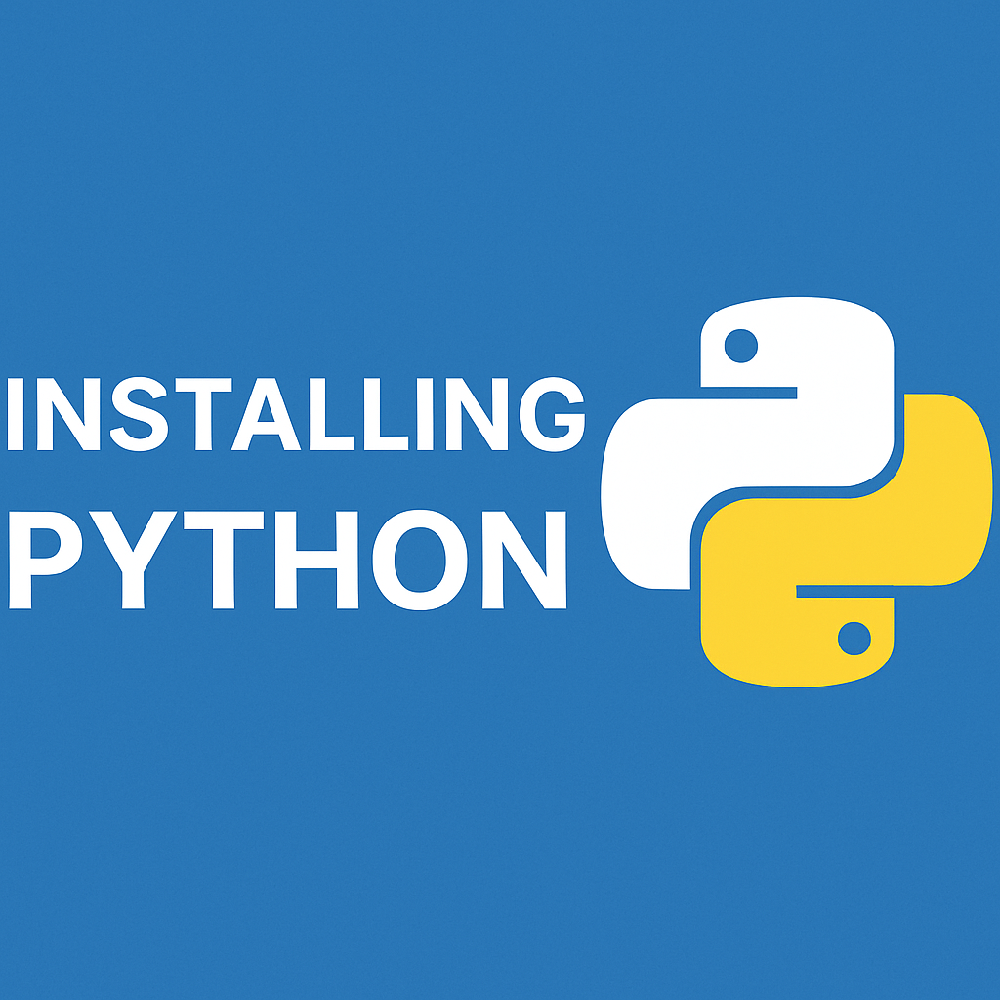

<h2>Videos for Software Installations</h2>

<h3> Power BI</h3>

<h3> Python</h3>
Link to UV (used in Video for Installation)
<a href="https://docs.astral.sh/uv/getting-started/installation/">
 

<h4>Windows</h4>

 

<h4>MacOS</h4>

</a>

